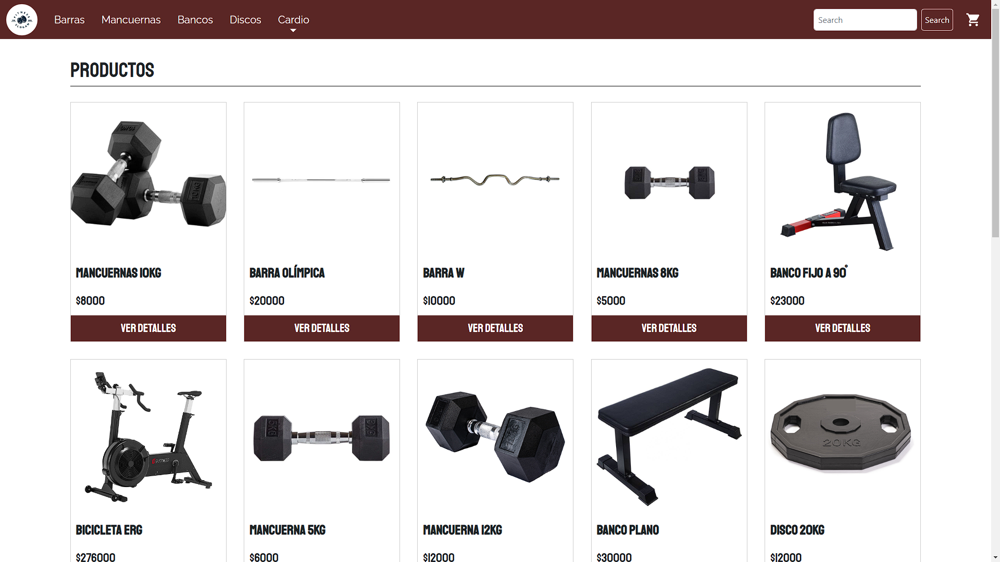

# Fitness Shop 🏋️‍♂️

Este e-commerce fue desarrollado con [**React JS**](https://reactjs.org/). Aquí podrás encontrar todo tipo de producto fitness de gama media y alta.

## Tecnologías 🛠️

- [**React JS**](https://reactjs.org/)
- [**Bootstrap**](https://getbootstrap.com/) / [**React-Bootstrap**](https://react-bootstrap.github.io/)
- [**SASS**](https://sass-lang.com/install)
- [**Firebase**](https://firebase.google.com/)

## Librerías

- [**React Router DOM**](https://www.npmjs.com/package/react-router-dom)
- [**React Toastify**](https://www.npmjs.com/package/react-toastify)
- [**React SweetAlert 2**](https://sweetalert2.github.io/)
- [**MUI**](https://mui.com/)

## Autor ✍

- **Alejo Feas Matej** - *FrontEnd Web Developer en formación*, 15 de junio de 2021 - [alefeas](https://github.com/alefeas)

## Licencias 📃

Cualquier persona es libre de analizar, estudiar, copiar o mejorar este proyecto. Se agradecerá citar esta fuente cuando sea usado.